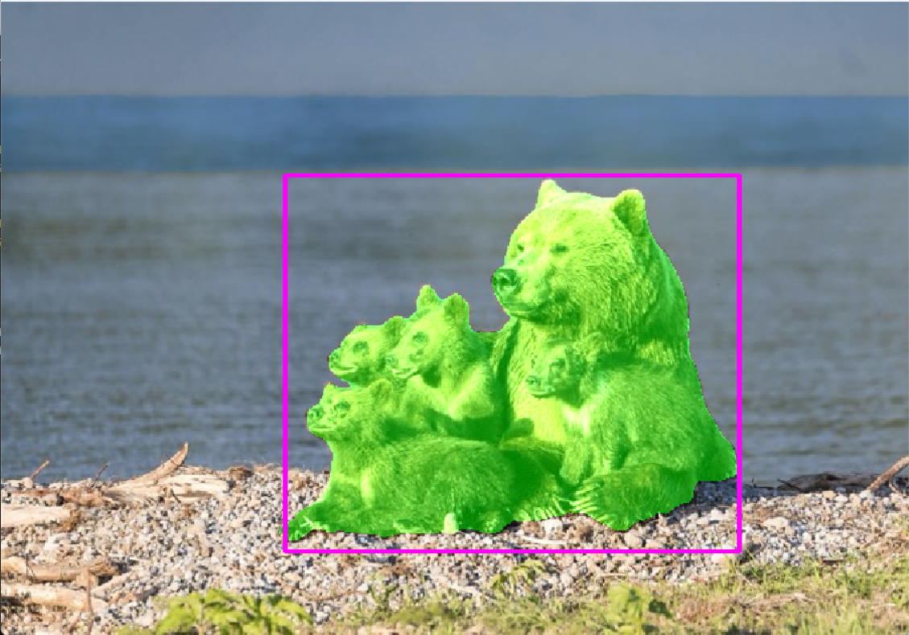
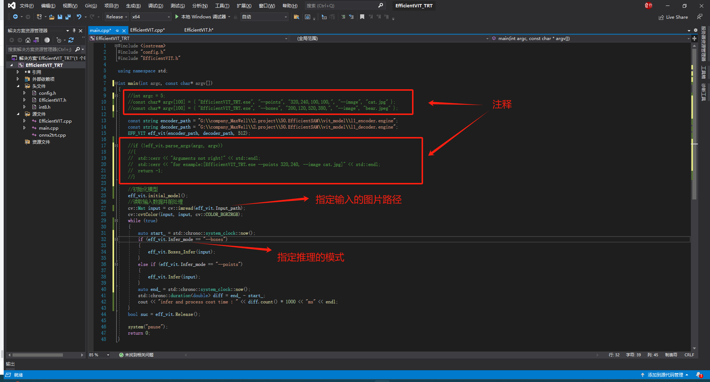
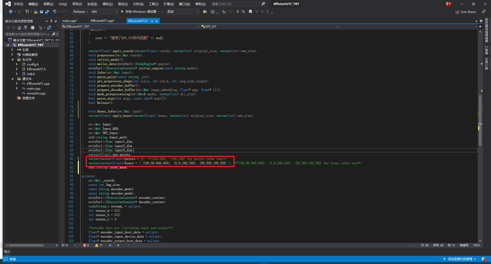

<!-- markdownlint-disable MD033 MD041 -->

  <h3 align="center">⌨️ Let us use the efficient sam！</h3>

<!-- markdownlint-enable MD033 -->
## ⚡ Enviroments
Generate the executable demo by CMakeLists.txt
1. TensorRT-8.6.1.6
2. OpenCV-4.5.5
3. CUDA-11.7

## ⚙ pt model -> engine
run the onnx2trt.cpp demo to convert the torch model(pt) to tensorrt model(engine).
encoder model and decoder model should be requested to convert to engine model.

## 🏃‍♂️ Run 
You should set the path of both encoder and decoder model, and set the direction of input image. Then, you can run the main.cpp
to segment anything.

* points推理：
输入指令：“EfficientVIT.exe --points 320,240,400,240, --image bear.jpeg”
这里的指令的意思即输入了两个点，分别是[320,240]和[400,240]，然后输入的图像是bear.jpeg。
推理结果如下图所示：

  如果直接运行代码的话，需要在.h文件里面指定好输入的点的坐标。

* boxes推理：
输入指令：“EfficientVIT.exe --boxes 200,120,520,380, --image bear.jpeg”
这里的指令的意思即输入了两个点，分别是[320,240]和[400,240]，然后输入的图像是bear.jpeg。
推理结果如下图所示：

为了方便调试，在main函数中，定义了argc和argv两个变量（本来应该是在终端运行时输入的参数）。如果想在头文件中直接指定好框的位置，我们可以将部分代码注释：

